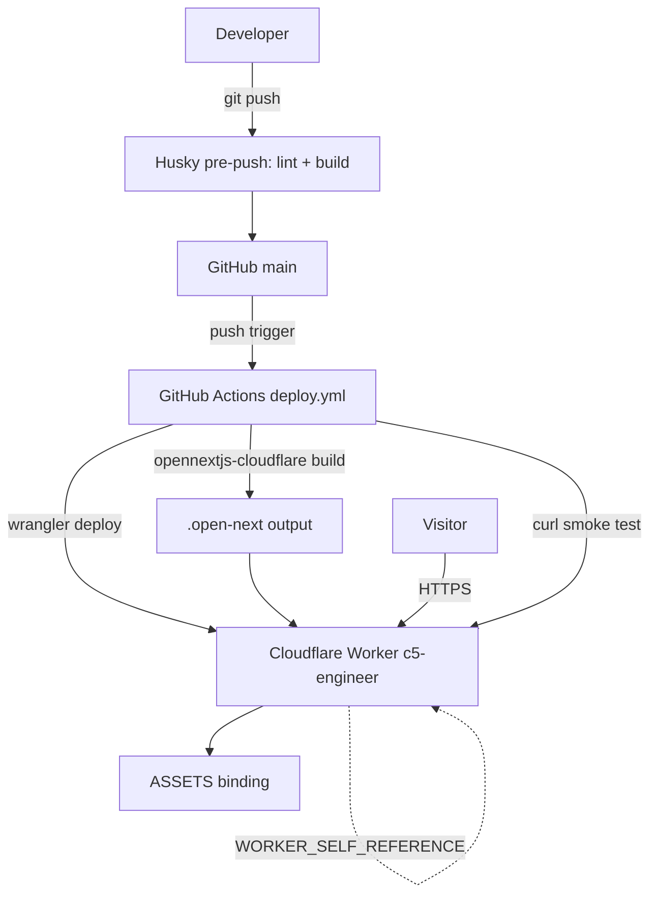

# Architecture

> Living map of system structure and data flow. Describes what the structure is now, not why a decision was made. See the project's ADRs for that, if it keeps any.

## System overview

## Modules

### Next.js app

`app/`, `next.config.ts`. App Router site. `next.config.ts` calls `initOpenNextCloudflareForDev()` so bindings work under `next dev`.

### OpenNext adapter

`open-next.config.ts` calls `defineCloudflareConfig()` with no cache override. `opennextjs-cloudflare build` runs `next build` itself and writes `.open-next/worker.js` and `.open-next/assets`. The output is gitignored.

### Worker config

`wrangler.jsonc`. Worker `c5-engineer` with entry `.open-next/worker.js` and flags `nodejs_compat` and `global_fetch_strictly_public`. Bindings are `ASSETS` (on `.open-next/assets`) and `WORKER_SELF_REFERENCE` (service binding to itself). No R2, KV or D1. `public/_headers` sets a one-year immutable cache on `/_next/static/*`.

### Pre-push hook

`.husky/pre-push` runs `yarn lint && yarn build` before any push. There are no PR checks.

### CI deploy

`.github/workflows/deploy.yml` runs on push to `main`, serialized by the `deploy` concurrency group. Steps are install, lint, adapter build, `cloudflare/wrangler-action` deploy, then a curl smoke test against the deployment URL. Secrets are `CLOUDFLARE_API_TOKEN` and `CLOUDFLARE_ACCOUNT_ID`.

## Flows

- [Push to live URL](architecture/deploy.md): pre-push hook, GitHub Actions build and deploy, smoke test.
