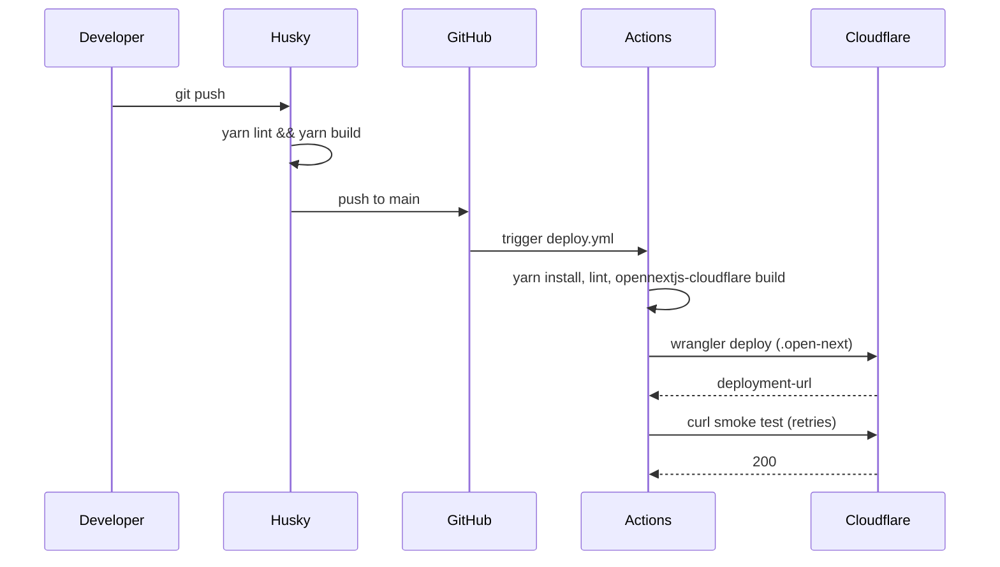

# Push to live URL

A `git push` to `main` runs the local pre-push hook, then triggers the GitHub Actions workflow. The workflow builds with the OpenNext adapter, deploys to Cloudflare Workers and checks the live URL. Crosses the pre-push hook, GitHub Actions and the Cloudflare Worker.

